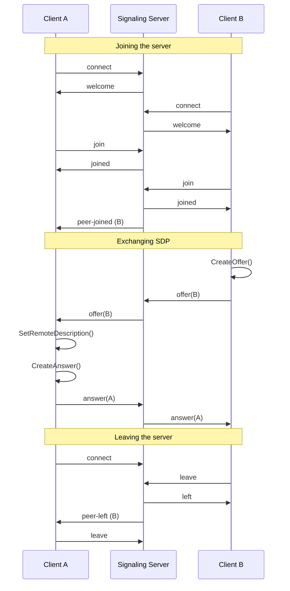

# WebRTC Signaling Messages

```mermaid
sequenceDiagram
	participant A as Client A
	participant S as Signaling Server
	participant B as Client B

	Note over A, B: Joining the server
	A->>S: connect
	S->>A: welcome
	
	B->>S: connect
	S->>B: welcome
	
	A->>S: join
	S->>A: joined
	
	B->>S: join
	S->>B: joined	
	S->>A: peer-joined (B)
	
	Note over A, B: Exchanging SDP
	B->>B: CreateOffer()
	B->>S: offer(B)
	S->>A: offer(B)
	A->>A: SetRemoteDescription()
	A->>A: CreateAnswer()
	A->>S: answer(A)
	S->>B: answer(A)
	
	note over A, B: Leaving the server
	A->>S: connect
	B->>S: leave
	S->>B: left
	S->>A: peer-left (B)
	A->>S: leave
```
